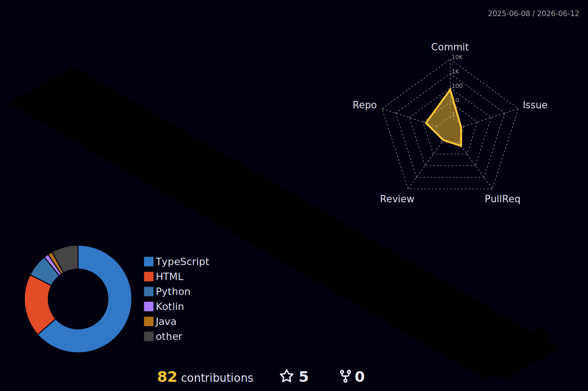

<div align="center">

<!-- Banner animado -->


<!-- Badges de redes sociales -->
[](https://github.com/JesusCaRu)
[](https://linkedin.com/in/jesus-canicio-rubi)
[](mailto:jesuscanicio33@gmail.com)
[](https://github.com/JesusCaRu)

</div>

---

## 🧑‍💻 Sobre mí

```typescript
const jesús = {
  nombre:       "Jesús Canicio Rubí",
  rol:          "Desarrollador Full Stack",
  ubicación:    "España 🇪🇸",
  pasiones:     ["clean code", "nuevas tecnologías", "código abierto"],
  actualmente:  "Construyendo proyectos que amplían mi portafolio 🚀",
  busco:        "Colaborar en proyectos open source interesantes",
  curiosidad:   "Cuando no programo, exploro nuevos lugares 🗺️",
  quote:        "El código es como el humor. Si hay que explicarlo, es malo."
};
```

---

## 🛠️ Stack Tecnológico

<div align="center">

### Frontend


### Backend & Herramientas


</div>

---

## 📊 Estadísticas de GitHub

<div align="center">


</div>

<div align="center">

[](https://github.com/JesusCaRu)

</div>

---

## 📈 Actividad reciente

<div align="center">

[](https://github.com/ashutosh00710/github-readme-activity-graph)

</div>

---

## 🏆 Trofeos

<div align="center">

[](https://github.com/ryo-ma/github-profile-trophy)

</div>

---

## 🗂️ Proyectos Destacados

<div align="center">

[](https://github.com/JesusCaRu/ProyectoFinal)

</div>

---

## 🌐 Contribuciones 3D

<div align="center">



</div>

---

<div align="center">

<!-- Footer con wave -->


*⭐ Si alguno de mis proyectos te ha sido útil, ¡considera dejar una estrella!*

</div>
