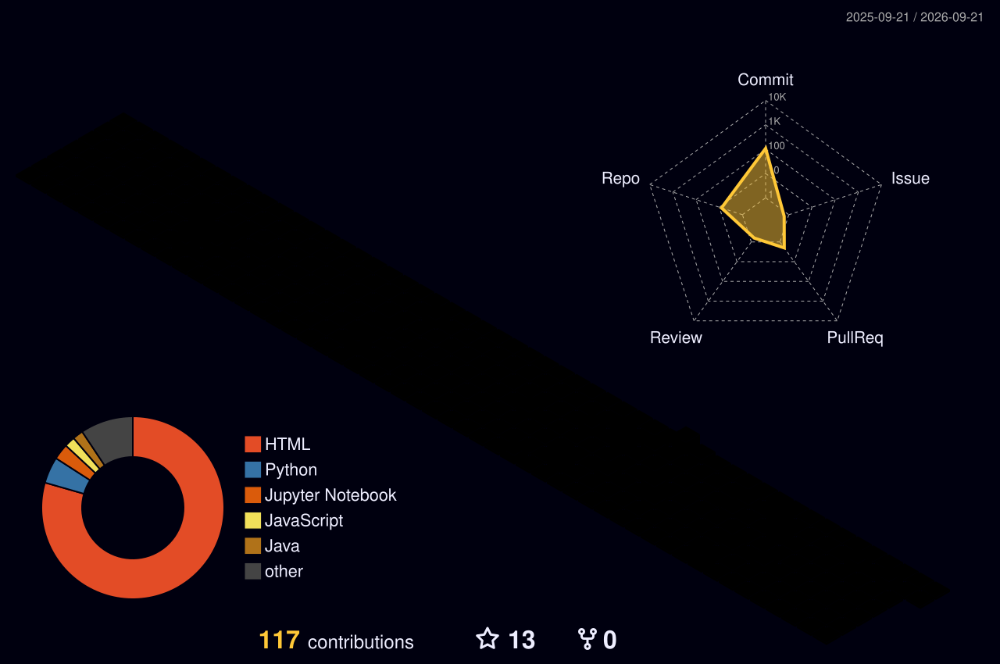

<div align="center">

  <!-- Header Banner -->
  

  <br/><br/>

  <!-- Typing SVG -->
  <a href="https://github.com/JesusCaRu">
    
  </a>

  <br/><br/>

  <!-- Social & Contact Badges -->
  <a href="https://github.com/JesusCaRu">
    
  </a>
  <a href="https://www.linkedin.com/in/jes%C3%BAs-canicio-ruiz-184374262/">
    
  </a>
  <a href="mailto:jesuscanicio33@gmail.com">
    
  </a>
  <a href="https://github.com/JesusCaRu">
    
  </a>

</div>

<br/>

---

## 🧑‍💻 Sobre mí

```typescript
const jesús = {
  nombre:       "Jesús Canicio Ruiz",
  rol:          "Desarrollador Full Stack",
  ubicación:    "España 🇪🇸",
  pasiones:     ["Clean Code", "Arquitectura Web", "Nuevas Tecnologías", "Open Source"],
  enfoque2026:  ["Desarrollo Full Stack escalable", "Optimización e IA integrada"],
  actualmente:  "Construyendo proyectos innovadores para potenciar mi portafolio 🚀",
  busco:        "Colaborar en proyectos de código abierto y retos exigentes 💡",
  quote:        "\"El código es como el humor. Si hay que explicarlo, es malo.\""
};
```

### ⚡ Datos rápidos
- 🔭 **Trabajando en:** Aplicaciones web Full Stack modernas y proyectos de alto rendimiento.
- 🌱 **Aprendiendo continuamente:** Nuevos frameworks, mejores prácticas de arquitectura y DevOps.
- 👯 **Abierto a:** Colaborar en proyectos Open Source y desarrollar soluciones creativas.
- 💬 **Pregúntame sobre:** JavaScript, TypeScript, React, Node.js, Python o diseño de APIs.
- ⚡ **Curiosidad:** Cuando no estoy programando, me apasiona explorar nuevos lugares y resolver problemas complejos.

---

## 🛠️ Stack Tecnológico

<div align="center">

### 🚀 Mis Tecnologías Principales

<a href="https://skillicons.dev">
  
</a>

<br/><br/>

### 🎯 Desglose por Categorías

#### Frontend


#### Backend & Bases de Datos


#### DevOps & Herramientas


</div>

---

## 📊 Estadísticas & Analíticas de GitHub

<div align="center">


</div>

<br/>

<div align="center">

[](https://github.com/JesusCaRu)

</div>

---

## 📈 Gráfico de Actividad

<div align="center">

[](https://github.com/ashutosh00710/github-readme-activity-graph)

</div>

---

## 🗂️ Proyectos Destacados

<div align="center">

<table>
  <tr>
    <td width="50%" valign="top">
      <h3 align="center">📦 StockFlow - Gestor de Inventario</h3>
      <p align="center">
        <a href="https://github.com/JesusCaRu/StockFlow_Gestor_de_inventario">
          
        </a>
      </p>
      <p align="center">
        Aplicación integral para la gestión eficiente de inventarios, stock y productos con interfaz moderna y rápida.
      </p>
      <p align="center">
        
        
      </p>
    </td>
    <td width="50%" valign="top">
      <h3 align="center">🌟 TikTok Wrapper</h3>
      <p align="center">
        <a href="https://github.com/JesusCaRu">
          
        </a>
      </p>
      <p align="center">
        Herramienta y wrapper optimizado para interacción y automatización con contenido multimedia de TikTok.
      </p>
      <p align="center">
        
        
      </p>
    </td>
  </tr>
</table>

</div>

---

## 🌐 Contribuciones 3D

<div align="center">



</div>

---

<div align="center">

<!-- Footer Wave -->


*⭐ Si alguno de mis proyectos te ha sido útil o te resulta interesante, ¡deja una estrella en mis repositorios!*

<br/>

<a href="#-sobre-mí">
  
</a>

</div>
